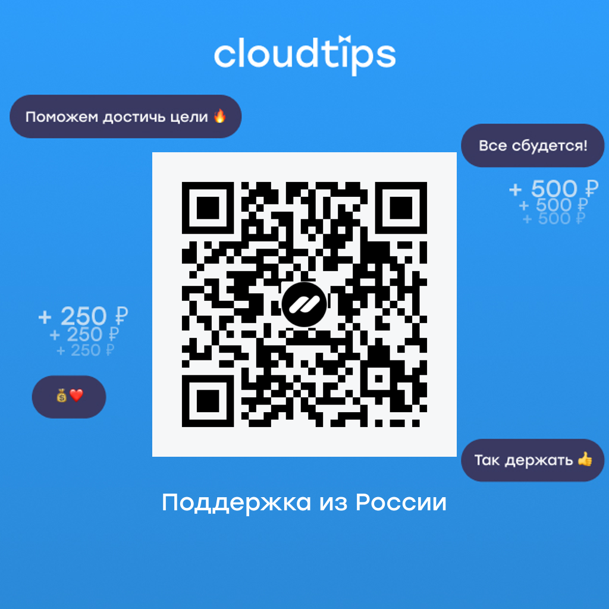

Кратко: Персональный блог, как приложение к YouTube каналу.

Персональный блог, как приложение к YouTube каналу.

[Читать](https://trash-max.github.io)

[Смотреть](https://www.youtube.com/c/MaxTrash)

[Поддержать](https://www.buymeacoffee.com/maxtrash)

[Поддержать из Росии](https://pay.cloudtips.ru/p/5acab2cd)

Ссылки на все мои соцсети внизу страницы.

